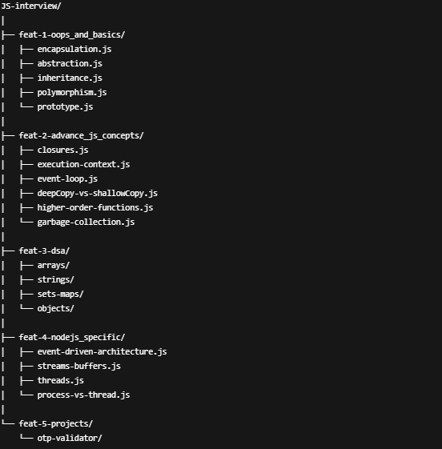

# 📘 JavaScript & Node.js Interview Prep – Practice Repository  

[]
[]  

> **Welcome to **JS-Interview**, my dedicated practice repository for **JavaScript, Node.js, and interview-focused coding concepts**.  
This repo is built not only as my personal **knowledge vault** but also as a **resource for learners and mentees** I guide in their preparation journey.  

---

## 🚀 Repository Structure  

The repository is organized in **feature-based folders** so learners can follow a **step-by-step path**:  



### 📂 **feat-5-projects**
- **OTP Validator** mini-project (regex validation, async API simulation, error handling)  

---

## 📌 Learning Roadmap Checklist  

Follow this roadmap step by step (tick ✅ as you progress):  

- [ ] **Step 1** → Understand OOP Basics (`feat-1-oops_and_basics`)  
- [ ] **Step 2** → Dive into Advanced JS Concepts (`feat-2-advance_js_concepts`)  
- [ ] **Step 3** → Practice Data Structures & Algorithms in JS (`feat-3-dsa`)  
- [ ] **Step 4** → Explore Node.js Specific Internals (`feat-4-nodejs_specific`)  
- [ ] **Step 5** → Build & Understand Projects (start with OTP Validator) (`feat-5-projects`)  

---

## 💡 How to Use  

- Clone the repo and explore topic-wise.  
- Each folder builds on the **previous one** → from **basics to advanced concepts**.  
- Files contain **self-explanatory examples with comments** for quick revision.  

```bash
git clone https://github.com/<your-username>/JS-interview.git
cd JS-interview

---

## 📬 Connect with Me  

👤 **Lakshmi Narasimhan**  
- 🌐 [Portfolio](https://lakshmi-narasimhan-portfolio.web.app)  
- 💼 [LinkedIn](https://www.linkedin.com/in/lakshmi-narasimhan-developer)  
- 📧 [Email Me](mailto:lakshminarasimhan511@gmail.com)  

---